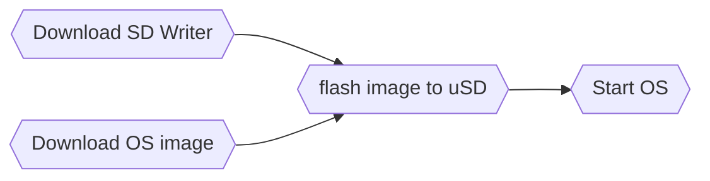
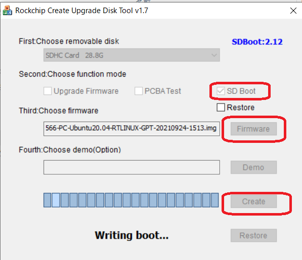
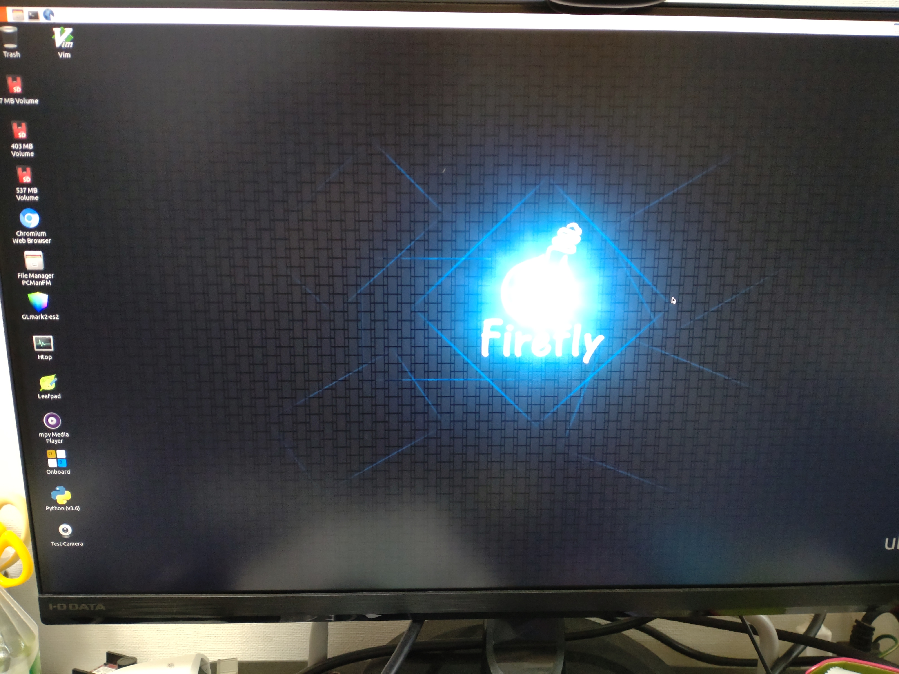

# Preface

This is Firefly EC-R3566PC Ubuntu installation guide. EC-R3566PC is an affortable, self-contained, reasonably fast with Cortex-A55 6 CPUs and stable hardware for your aarch64 linux programming study. 

For your imformation, there are several public information on the web.

 - Download site : https://en.t-firefly.com/doc/download/96.html
 - Board specification : https://download.t-firefly.com/%E4%BA%A7%E5%93%81%E8%A7%84%E6%A0%BC%E6%96%87%E6%A1%A3/%E5%B5%8C%E5%85%A5%E5%BC%8F%E4%B8%BB%E6%9C%BA/EC-R3566PC%20Specification.pdf
 - Board manual : https://wiki.t-firefly.com/en/EC-R3566PC/ or https://wiki.t-firefly.com/ROC-RK3566-PC/index.html

## Index <!-- omit in toc -->

<!-- @import "[TOC]" {cmd="toc" depthFrom=1 depthTo=6 orderedList=false} -->

<!-- code_chunk_output -->

- [Preface](#preface)
  - [Index <!-- omit in toc -->](#index-omit-in-toc-)
  - [1. Get start with SD card for Beginners](#1-get-start-with-sd-card-for-beginners)
      - [Download SD Writer](#download-sd-writer)
      - [Download OS image](#download-os-image)
      - [flash image to uSD](#flash-image-to-usd)
      - [Start Ubuntu 18.04](#start-ubuntu-1804)
        - [Tips : Migrate date to MMC device(as root, not sudo)](#tips-migrate-date-to-mmc-deviceas-root-not-sudo)
        - [Tips : User ID and password](#tips-user-id-and-password)
        - [Tips : Enable mDSN and remote SSH access from your host](#tips-enable-mdsn-and-remote-ssh-access-from-your-host)
        - [Tips : Enable WiFi from CLI](#tips-enable-wifi-from-cli)
  - [2. Build your own Linux image and flash to the board](#2-build-your-own-linux-image-and-flash-to-the-board)
- [Revision History](#revision-history)

<!-- /code_chunk_output -->


## 1. Get start with SD card for Beginners

Let's use Windows 10 host environment, here is the way to go.


R3566PC software download site is [here](https://en.t-firefly.com/doc/download/96.html).

#### Download SD Writer

Download FireFly SD writer from [here](pict\R3566-SDTool1.jpg) then install. After SD tool installation, set ```Selected=2``` at application config file to change language code in `SDDiskTool_v1.7/config.ini`.

#### Download OS image

 - Buildroot image is [here](pict\R3566-Buildroot.jpg).
 - Ubuntu image is [here](pict\R3566-UbuntuImage.jpg). Choose 18.04 for stable test, some issue in 20.04 image.

#### flash image to uSD

Connect all necesarry cables such as `USB keyboard`, `USB mouse`, `HDMI`, `USB-C power supply` and `Ethernet cable` to your R3566PC board. Your machine may look like that.


Before flashing images to uSD card, recommending to reformat the uSD by overwrite. (Quick format makes some issues wehn you flash the images.) For the SD card format, you can download `SD Memory Card Formatter Application` from [SD associates](https://www.sdcard.org/downloads/formatter/). Full formatting takes about 15min(32G), but it is worth doing to avoid data conflict issue only by quick format.

Then start `SD_Firmware_Tool.exe`, then choose `SD Boot`, set `Firmware` to unziped OS image(xxx.img), then click `Create`. It may takes 3-5 mins to complete.



Now insert your uSD card into R3566PC, then power on USB-C power supply.

#### Start Ubuntu 18.04

If everything is ok, after 2-3min boot sequence, you have login console in your HDMI display. 


You can start your program development now. But before doing that, please refer some tips for your work efficiencies and conveniencies.

##### Tips : Migrate date to MMC device(as root, not sudo)

* You can find sample script from [here](ubuntu1804\r3566pc_bionic_move_mmc.sh) or 
    ```
    root@firefly: curl https://raw.githubusercontent.com/snakajim/r3566pc-install/main/ubuntu1804/r3566pc_bionic_move_mmc.sh > r3566pc_bionic_move_mmc.sh
    ```

In the board, you have 64G or 32G MMC storage. To use the MMC device for `/`, you need to use complex `Boot Mode` instead of uSD boot. In here, exploring much easier way to migrate your critical directories, such as `/home,/var,/usr,/tmp`, on the MMC. 

Let's login as root and start.

- First Check your storage by `lsblk` and make backup for `/etc/fstab`
    ```
    root@firefly: lsblk
    mmcblk0 <- This is on board MMC
    ...
    mmcblk1 <- This is uSD card
    ...
    root@firefly: cp /etc/fstab /etc/fstab.bak
    root@firefly: cp /etc/fstab /etc/fstab.new
    ```

-  Next, make Partition in `/dev/mmcblk0`(on board MMC) and format each partision. 

    ```
    root@firefly: fdisk -l /dev/mmcblk0
    ....(Make 4 partitions, write and quit)....
    root@firefly: mkfs.ext4 /dev/mmcblk0p1
    root@firefly: mkfs.ext4 /dev/mmcblk0p2
    root@firefly: mkfs.ext4 /dev/mmcblk0p3
    root@firefly: mkfs.ext4 /dev/mmcblk0p4
    ```
- Next, mount `/dev/mmcblk0p1` as `/mnt/XXX` and copy original folder in there.
    ```
    root@firefly: mkdir -p /mnt/XXX && mount -t ext4 -o defaults /dev/mmcblk0p1 /mnt/XXX
    root@firefly: cd /tmp && sh -c "tar cf - . | ( cd /mnt/XXX; tar xvf -)"
    ```
- Next, Update your `/etc/fstab.new` and unmount `/mnt/XXX`.
    ```
    root@firefly: cat << EOF | tee -a /etc/fstab.new
    /dev/mmcblk0p1 /tmp  ext4  defaults  1 3
    EOF
    root@firefly: umount /mnt/XXX && rm -rf /mnt/XXX
    ```

- Finally, replace `/etc/fstab` and reboot to activate new `/etc/fstab`
    ```
    root@firefly: cp /etc/fstab.new /etc/fstab
    root@firefly: mount -a
    root@firefly: reboot
    ```

Repeat this process to each `/home,/var,/usr,/tmp` directory. Once all done, you can see the new storage map.
```
root@firefly: lsblk | grep mmcblk0
mmcblk0      179:0    0 58.3G  0 disk
├─mmcblk0p1  179:1    0    1G  0 part /tmp
├─mmcblk0p2  179:2    0   10G  0 part /var
├─mmcblk0p3  179:3    0   10G  0 part /usr
└─mmcblk0p4  179:4    0 37.3G  0 part /home
mmcblk0boot0 179:32   0    4M  1 disk
mmcblk0boot1 179:64   0    4M  1 disk
```

Now your hardware is faster and stable, since some of critical directories are stored in MMC, but not in slow & unstable uSD card. 

##### Tips : User ID and password
https://wiki.t-firefly.com/en/Firefly-Linux-Guide/manual_ubuntu.html
- Firefly user password: firefly
- Root user: No root password is set by default. Firefly users configure the root password by themselves through the sudo passwd root command.

##### Tips : Enable mDSN and remote SSH access from your host

* You can find sample script from [here](ubuntu1804\r3566pc_bionic_init.sh) or 

    ```
    firefly@firefly: curl https://raw.githubusercontent.com/snakajim/r3566pc-install/main/ubuntu1804/r3566pc_bionic_init.sh > r3566pc_bionic_init.sh
    ```

Install avahi-daemon then enable. And change `/etc/ssh/sshd_config` to allow root login(this is not recommended for security purpose, but only for debug purpose).

```
firefly@firefly: sudo apt -y update
firefly@firefly: sudo apt-get install -y avahi-daemon
firefly@firefly: sudo systemctl restart avahi-daemon.service
firefly@firefly: sudo sed -i -e "s/^#PermitRootLogin prohibit-password/PermitRootLogin yes/" /etc/ssh/sshd_config
firefly@firefly: sudo service sshd restart
firefly@firefly: sudo reboot
```

Now your R3566PC is visible in your local network as `hostname=firefly` and `domain=local`. You can access the board from your host SSH terminal.
```
HOST :> ssh firefly@firefly.local
```

As optional, change `/etc/lightdm/lightdm.conf.d/` to disable auto login in GUI.

```
firefly@firefly: sudo sed -i -e "s/^autologin-user/#autologin-user/" /etc/lightdm/lightdm.conf.d/20-autologin.conf
firefly@firefly: sudo service lightdm restart
```

##### Tips : Enable WiFi from CLI

WiFi is disabled as default setting, so let's connect to your home WiFi(`SSID=XXXXXXXXXXXXXXX`).
```
firefly@firefly: nmcli device status
DEVICE  TYPE      STATE         CONNECTION
eth0    ethernet  connected     Wired connection 1
wlan0   wifi      disconnected  --
lo      loopback  unmanaged     --
firefly@firefly: nmcli device wifi list
IN-USE  SSID                            MODE   CHAN  RATE        SIGNAL  BARS  SECURITY 
        XXXXXXXXXXXXXXX                 Infra  9     540 Mbit/s  55      ▂▄__  WPA2
        YYYYYYYYYYYYYYY                 Infra  9     65 Mbit/s   50      ▂▄__  WPA2
```

To set WiFI password for SSID=XXXXX,
```
firefly@firefly: SSID="<your WiFi SSID>"
firefly@firefly: WIFIPASS="<your WiFi SSID password>"
firefly@firefly: sudo nmcli device wifi connect ${SSID} password ${WIFIPASS} ifname wlan0
Device 'wlan0' successfully activated with 'zzz-zzzzzzz-zzz-zzzz'.
```

You can confirm that wlan0 is in use.

```
firefly@firefly:~$ nmcli device wifi list
IN-USE  SSID                            MODE   CHAN  RATE        SIGNAL  BARS  SECURITY 
*       XXXXXXXXXXXXXXX                 Infra  9     540 Mbit/s  56      ▂▄▆_  WPA2
        YYYYYYYYYYYYYYY                 Infra  9     65 Mbit/s   54      ▂▄__  WPA2
firefly@firefly:~$ nmcli device status
DEVICE  TYPE      STATE      CONNECTION
eth0    ethernet  connected  Wired connection 1
wlan0   wifi      connected  XXXXXXXXXXXXXXX
lo      loopback  unmanaged  --        
```

## 2. Build your own Linux image and flash to the board

This is for intermidiate users. Contents TBD.

# Revision History
- v22.04 initial version, only SD boot mode and some tips.