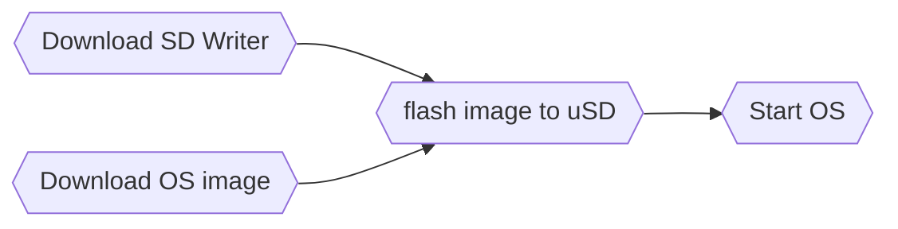
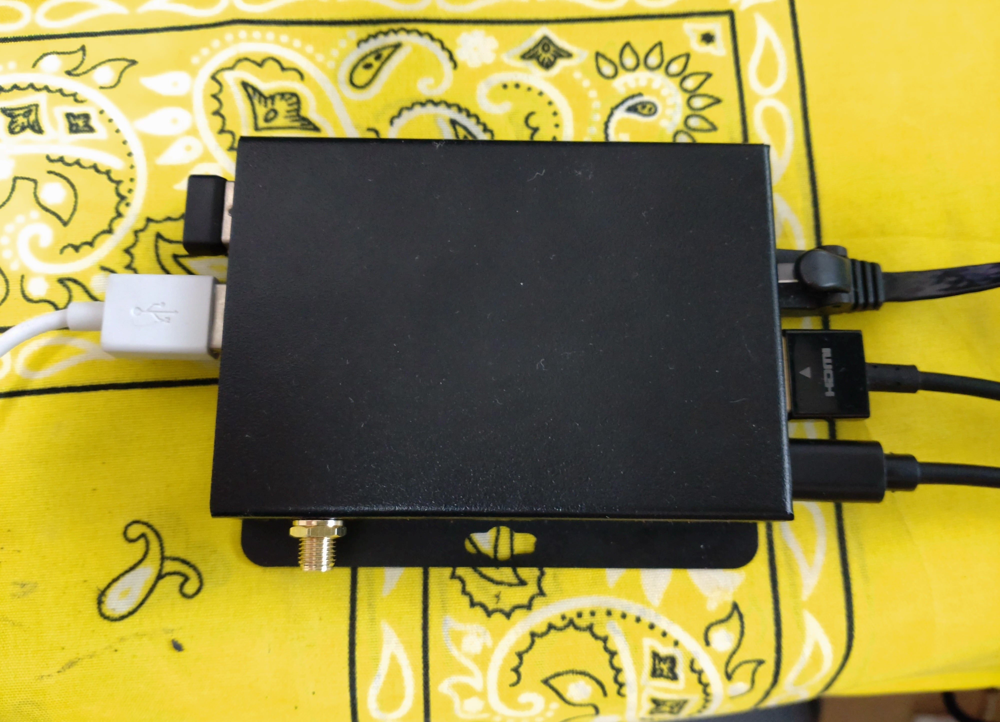

# R3566PC installation Guide.

This is Firefly EC-R3566PC ubuntu installation guide. About Firefly R3566PC board, there are several public information.

 - Download site https://en.t-firefly.com/doc/download/96.html
 - Board specification https://download.t-firefly.com/%E4%BA%A7%E5%93%81%E8%A7%84%E6%A0%BC%E6%96%87%E6%A1%A3/%E5%B5%8C%E5%85%A5%E5%BC%8F%E4%B8%BB%E6%9C%BA/EC-R3566PC%20Specification.pdf
 - Board manual https://wiki.t-firefly.com/en/EC-R3566PC/ or https://wiki.t-firefly.com/ROC-RK3566-PC/index.html

## Index <!-- omit in toc -->

<!-- @import "[TOC]" {cmd="toc" depthFrom=1 depthTo=6 orderedList=false} -->

<!-- code_chunk_output -->

- [R3566PC installation Guide.](#r3566pc-installation-guide)
  - [Index <!-- omit in toc -->](#index-omit-in-toc-)
- [Get start](#get-start)
    - [Download SD Writer](#download-sd-writer)
    - [Download OS image](#download-os-image)
  - [flash image to uSD](#flash-image-to-usd)
  - [Start Ubuntu 18.04](#start-ubuntu-1804)
      - [Tips : Use on board MMC for storage](#tips-use-on-board-mmc-for-storage)
      - [Tips : User ID and password](#tips-user-id-and-password)
      - [Tips : Enable mDSN and remote SSH access from your host](#tips-enable-mdsn-and-remote-ssh-access-from-your-host)
- [Revision](#revision)

<!-- /code_chunk_output -->


# Get start

Let's use Windows 10 host environment, here is the way to go.


R3566PC software download site is [here](https://en.t-firefly.com/doc/download/96.html).

### Download SD Writer

Download FireFly SD writer from [here](pict\R3566-SDTool1.jpg) then install. After SD tool installation, set ```Selected=2``` at application config file to change language code in `SDDiskTool_v1.7/config.ini`.

### Download OS image

 - Bildroot image is [here](pict\R3566-Buildroot.jpg).
 - Ubuntu image is [here](pict\R3566-UbuntuImage.jpg). Choose 18.04, some issue in 20.04 image.

## flash image to uSD

Connect all necesarry cables such as `USB keyboard`, `USB mouse`, `HDMI`, `USB-C power cable` and `Ethernet cable` to your R3566PC board. Your machine may look like that.



Before flashing images to uSD card, recommending to reformat the uSD by overwrite. (Quick format makes some issues wehn you flash the images.) For the SD card format, you can download `SD Memory Card Formatter Application` from [SD associates](https://www.sdcard.org/downloads/formatter/). Full formatting takes about 15min(32G), but it is worth doing to avoid data conflict issue only by quick format.

Then start `SD_Firmware_Tool.exe`, the choose `SD boot`, set `Firmware` to your download OS image, then click `Create`. It may takes 3-5 mins to complete.


Now insert your uSD card into R3566PC, then power on!

## Start Ubuntu 18.04

If everything is ok, after 2-3min boot sequence, you have login console in your HDMI display. 


You can start your program now. But before doing that, you can refer some tips for your work efficiencies and conveniencies.

#### Tips : Use on board MMC for storage
In the board, you have 64G or 32G MMC storage. To use the MMC device for `/`, you need to use complex `Boot Mode` instead of uSD boot. In here, browsing much easier way to migrate your critical directory, such as `/home,/var,/usr/lcoal,/tmp`, on the MMC. 

- First Check your storage by `lsblk`.
    ```
    root@firefly: lsblk
    mmcblk0 <- This is on board MMC
    ...
    mmcblk1 <- This is uSD card
    ...
    ```

-  Next, make Partition in `/dev/mmcblk0`(on board MMC) and format each partision. 

    ```
    root@firefly:sudo fdisk -l /dev/mmcblk0
    ....(Make partitions, save and quit)....
    root@firefly: sudo mkfs.ext4 /dev/mmcblk0p1
    root@firefly: sudo mkfs.ext4 /dev/mmcblk0p2
    root@firefly: sudo mkfs.ext4 /dev/mmcblk0p3
    root@firefly: sudo mkfs.ext4 /dev/mmcblk0p4
    ```
- Next, mount them as `/mnt/XXX` and copy original folder in there.
    ```
    root@firefly:
    ```
- Next, Unmount and update your `/etc/fstab`
    ```
    root@firefly:
    ```

- Finally, reboot to activate new `/etc/fstab`

#### Tips : User ID and password
https://wiki.t-firefly.com/en/Firefly-Linux-Guide/manual_ubuntu.html
- Firefly user password: firefly
- Root user: No root password is set by default. Firefly users configure the root password by themselves through the sudo passwd root command.

#### Tips : Enable mDSN and remote SSH access from your host

```
root@firefly: sudo apt -y install
root@firefly: 
```

# Revision
- v22.04 initial version, only SD boot mode and some tips.