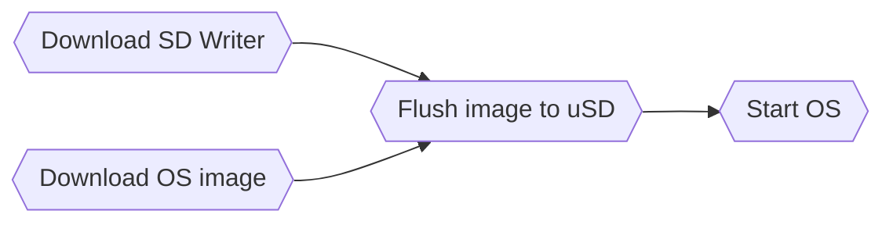

# R3566PC installation Guide.

This is Firefly EC-R3566PC ubuntu installation guide. About Firefly R3566PC board, there are several public information.

 - Download site https://en.t-firefly.com/doc/download/96.html
 - Board specification https://download.t-firefly.com/%E4%BA%A7%E5%93%81%E8%A7%84%E6%A0%BC%E6%96%87%E6%A1%A3/%E5%B5%8C%E5%85%A5%E5%BC%8F%E4%B8%BB%E6%9C%BA/EC-R3566PC%20Specification.pdf
 - Board manual https://wiki.t-firefly.com/en/EC-R3566PC/ or https://wiki.t-firefly.com/ROC-RK3566-PC/index.html

## Index

# Get start

Let's use Windows 10 host environment, here is the way to go.


R3566PC software download site is [here](https://en.t-firefly.com/doc/download/96.html).

### Download SD Writer

Download SD writer from [here](pict\R3566-SDTool1.jpg) then install. After SD tool installation, set ```Selected=2``` at application config file to change language code in `SDDiskTool_v1.7/config.ini`.

### Download OS image

 - Bildroot image is [here](pict\R3566-Buildroot.jpg).
 - Ubuntu image is [here](pict\R3566-UbuntuImage.jpg). Choose 18.04, some issue in 20.04 image.

## Flush image to uSD

Start `SD_Firmware_Tool.exe`, the choose `SD boot`, set `Firmware` to your download OS image, then `Create`. It may takes 3-5 mins to complete.


Insert uSD in the socket, also connect all necesarry cables such as `USB keyboard`, `USB mouse`, `HDMI`, `USB-C power cable` and `Ethernet cable`. Your machine may look like that.


## Start Ubuntu 18.04

If everything is ok, after 2-3min boot sequence, you have login console in your HDMI display. 


### use on board MMC for storage
In the board, you have another 64G MMC storage so let's use it for `/`. 
```
root@firefly:lsblk
mmcblk0 <- On board MMC
...
mmbblk1 <- uSD card
...
```
Format MMC, mount it as /tmp/rootmmc then copy root directory(`/`) to the /tmp/rootmmc.

```
root@firefly:lsblk
```

Update your /etc/fstab

root@firefly:mount -o remount /var
```

### User ID and password
https://wiki.t-firefly.com/en/Firefly-Linux-Guide/manual_ubuntu.html
- Firefly user password: firefly
- Root user: No root password is set by default. Firefly users configure the root password by themselves through the sudo passwd root command.

### Enable mDSN and remote SSH access from your host


